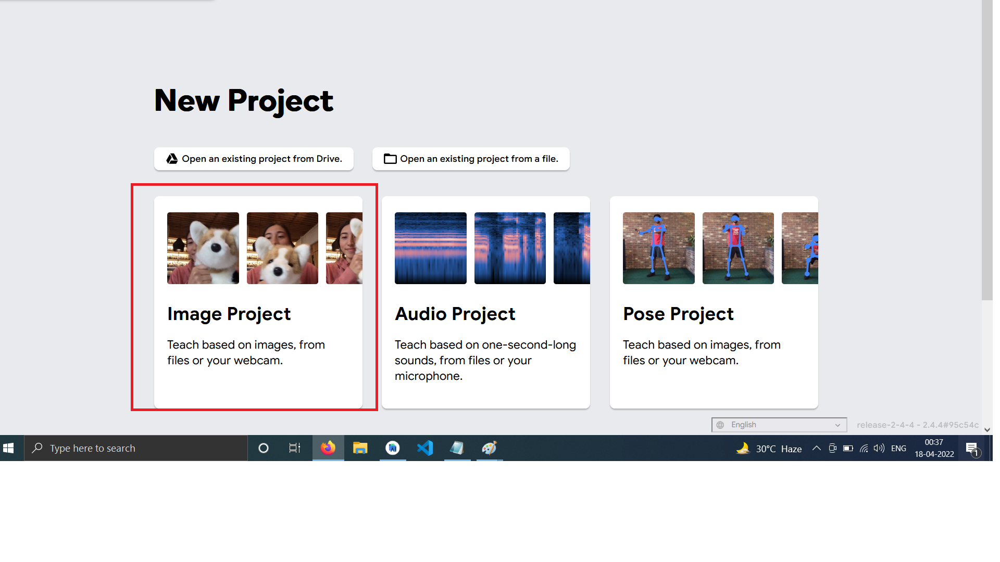
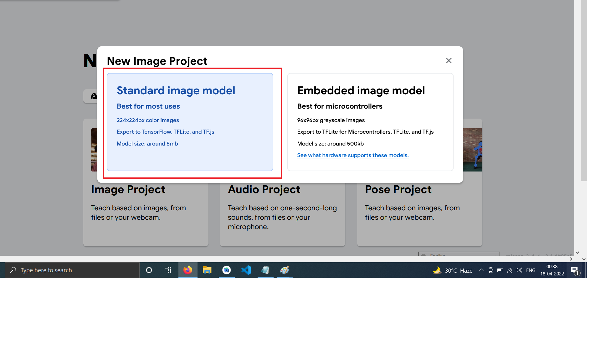
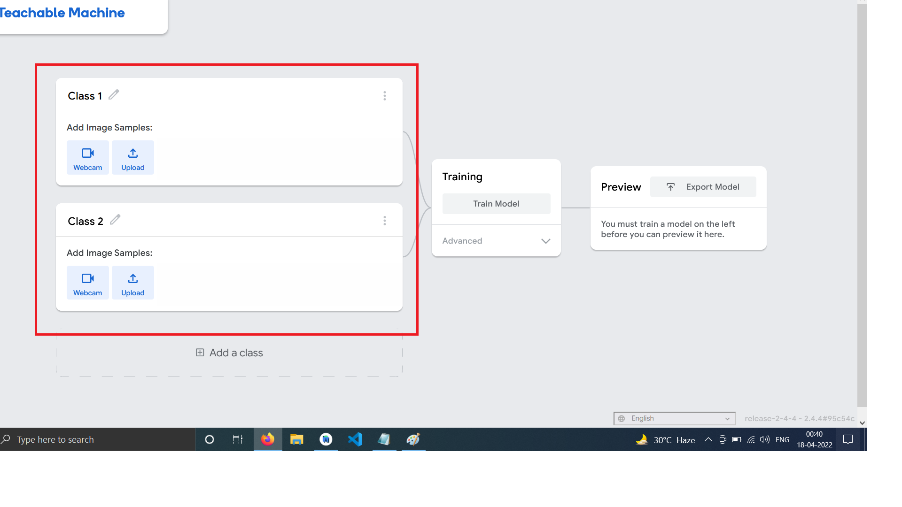

# Face Detection in Flutter:

 For creating your model go at [Image Model - Teachable Machine](https://teachablemachine.withgoogle.com/train/image).

- In that choose below (Image Project)

- Then choose Standard Image Model

- Then add your class names and train your model

- Then download that model in your PC / Laptop and put that file in your Assets folder in your Flutter project.

## And after that use my code which you may find in this repository and after that you'll also get below output. :slightly_smiling_face:

